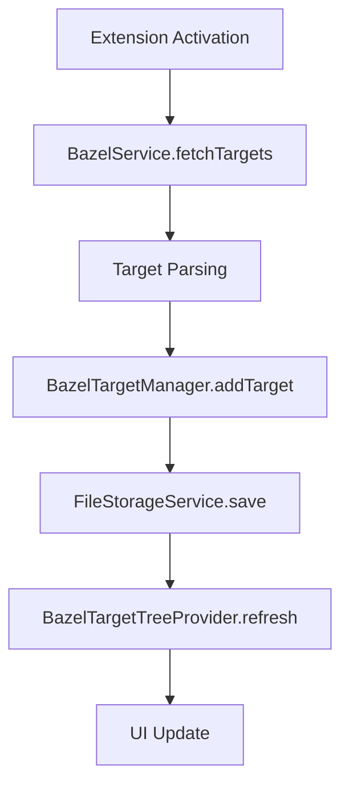
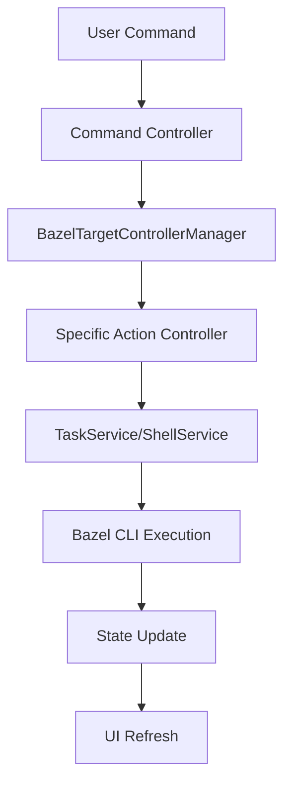
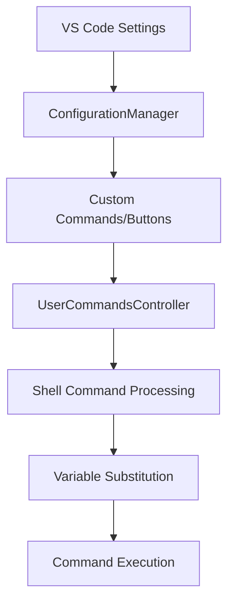
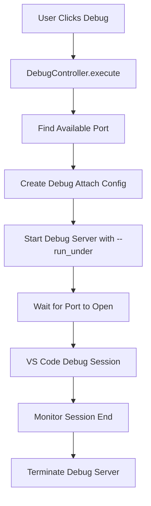
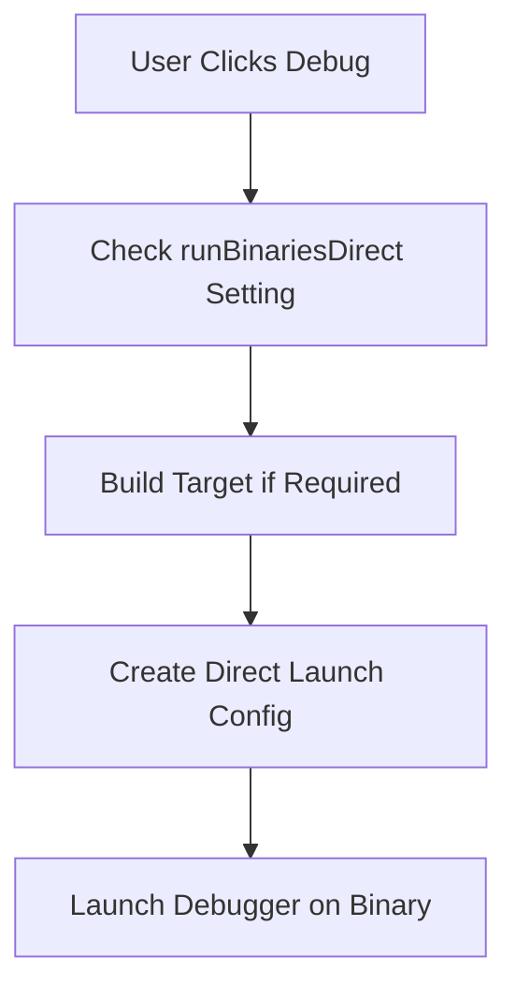

# Blue Bazel Extension - Design Document

## Overview

Blue Bazel is a VS Code extension that provides comprehensive integration for Bazel projects, offering UI-driven build, run, debug, and test capabilities. The extension follows a layered architecture with clear separation between models, services, controllers, and UI components.

## Architecture

### High-Level Architecture

```
┌─────────────────────────────────────────────────────────────────┐
│                        VS Code Extension                         │
├─────────────────────────────────────────────────────────────────┤
│  UI Layer (Tree View, Code Lens, Quick Picks, Terminals)       │
├─────────────────────────────────────────────────────────────────┤
│  Controllers (Command Handlers, Event Listeners)                │
├─────────────────────────────────────────────────────────────────┤
│  Models (Target Management, State Management, Configuration)     │
├─────────────────────────────────────────────────────────────────┤
│  Services (Bazel CLI, Shell, File System, Language Support)     │
├─────────────────────────────────────────────────────────────────┤
│                        VS Code API                               │
└─────────────────────────────────────────────────────────────────┘
```

### Core Components

#### 1. Extension Entry Point (`src/extension.ts`)

**Responsibilities:**
- Extension activation and initialization
- Dependency injection setup
- Service, model, controller, and UI component orchestration
- Extension visibility management

**Key Functions:**
- `activate()`: Main extension entry point
- `initExtension()`: Comprehensive initialization sequence
- `makeExtensionVisible()`: Manages when clause activation

#### 2. Services Layer (`src/services/`)

**BazelService** (`bazel-service.ts`)
- Interface to Bazel CLI
- Target discovery and parsing
- Bazel command execution
- Rule type to language mapping

**ConfigurationManager** (`configuration-manager.ts`)
- Extension settings management
- User preference handling
- Configuration validation

**ShellService** (`shell-service.ts`)
- Shell command execution
- Environment variable management
- Process lifecycle management

**TaskService** (`task-service.ts`)
- VS Code task integration
- Build/run/test task execution
- Task definition management

**WorkspaceService** (`workspace-service.ts`)
- Workspace detection and management
- Bazel workspace file handling

#### 3. Models Layer (`src/models/`)

**BazelTarget** (`bazel-target.ts`)
- Core target representation
- Properties: label, action, args, environment variables
- Serialization/deserialization support

**BazelTargetManager** (`bazel-target-manager.ts`)
- Target collection management
- Target persistence and loading
- Target discovery orchestration

**BazelTargetStateManager** (`bazel-target-state-manager.ts`)
- Runtime target state tracking
- Execution state management (idle, running, debugging)
- UI state synchronization

**BazelEnvironment** (`bazel-environment.ts`)
- Environment variable management
- Workspace-specific configuration
- Setup command handling

#### 4. Controllers Layer (`src/controllers/`)

**BazelController** (`bazel-controller.ts`)
- General Bazel operations (clean, format, build current file)
- Target refresh coordination
- File watcher integration

**BazelTargetControllerManager** (`target-controllers/bazel-target-controller-manager.ts`)
- Manages action-specific controllers
- Coordinates build, run, test, debug operations
- State management across controllers

**UserCommandsController** (`user-commands-controller.ts`)
- Custom command execution
- Shell command processing with variable substitution
- Custom button functionality

#### 5. UI Layer (`src/ui/`)

**BazelTargetTreeProvider** (`bazel-target-tree-provider.ts`)
- Main tree view data provider
- Target categorization and display
- Tree node management and refresh

**Code Lens Providers** (`code-lens-providers/`)
- Inline editor actions
- Language-specific integration
- Test/run button injection

## Data Flow

### Target Discovery and Management



### Command Execution Flow



### Configuration Flow



## Key Design Patterns

### 1. Dependency Injection
- Services are injected into controllers and models
- Enables testability and loose coupling
- Centralized initialization in `extension.ts`

### 2. Observer Pattern
- File watcher notifications
- Tree view refresh events
- State change propagation

### 3. Command Pattern
- All user actions implemented as commands
- Consistent command registration pattern
- Undo/redo capability through VS Code

### 4. Strategy Pattern
- Different target controllers for different actions
- Language-specific plugins
- Configurable shell command processing

## Extension Points for Modifications

### Adding New Bazel Actions

1. **Create Action Controller**
   ```typescript
   // src/controllers/target-controllers/my-action-controller.ts
   export class MyActionController extends BazelTargetController {
       protected async executeImpl(): Promise<void> {
           // Implementation
       }
   }
   ```

2. **Register in Controller Manager**
   ```typescript
   // In bazel-target-controller-manager.ts
   private createControllers(): Map<BazelAction, BazelTargetController> {
       return new Map([
           ['myaction', new MyActionController(...)],
           // existing controllers...
       ]);
   }
   ```

3. **Add Command Definition**
   ```json
   // In package.json contributes.commands
   {
       "command": "bluebazel.myaction",
       "title": "My Action",
       "icon": "$(symbol-method)"
   }
   ```

### Adding New Language Support

1. **Create Language Plugin**
   ```typescript
   // src/languages/plugins/my-language-plugin.ts
   export class MyLanguagePlugin implements LanguagePlugin {
       isTargetSupported(target: BazelTarget): boolean { }
       getCodeLensItems(target: BazelTarget): CodeLens[] { }
   }
   ```

2. **Register Plugin**
   ```typescript
   // In language-registry.ts
   export function registerLanguages() {
       registerCodeLensProvider(new MyLanguagePlugin());
   }
   ```

### Adding New Configuration Options

1. **Define in package.json**
   ```json
   "bluebazel.myNewSetting": {
       "type": "boolean",
       "default": false,
       "description": "My new setting description"
   }
   ```

2. **Access in Code**
   ```typescript
   const setting = configurationManager.getConfiguration().get<boolean>('myNewSetting');
   ```

### Custom UI Components

1. **Tree View Items**
   - Extend tree provider for new item types
   - Implement contextual commands
   - Add menu contributions

2. **Quick Picks**
   - Create custom selection interfaces
   - Integrate with existing target picker pattern

## Configuration System

### Built-in Configuration

The extension provides extensive configuration through VS Code settings:

- **Execution Settings**: `buildAtRun`, `runBinariesDirect`, `clearTerminalBeforeAction`
- **Target Discovery**: `fetchTargetsUsingQuery`, `refreshTargetsOnWorkspaceOpen`, `refreshTargetsOnFileChange`
- **Custom Commands**: `customButtons`, `shellCommands`
- **Environment**: `setupEnvironmentCommand`, `executableCommand`

### Variable Substitution System

The extension supports powerful variable substitution in custom commands:

```typescript
// Built-in variables
${bluebazel.runTarget}      // Current run target
${bluebazel.buildTarget}    // Current build target  
${bluebazel.executable}     // Bazel executable path
${bluebazel.runArgs}        // Current run arguments

// Interactive variables
[Pick(<command>)]           // Show picker with command output
[Input()]                   // Prompt for user input
```

### Custom Button Configuration

Users can extend the UI with custom buttons:

```json
{
  "bluebazel.customButtons": [{
    "title": "My Commands",
    "buttons": [{
      "title": "Custom Build",
      "command": "bazel build ${bluebazel.buildTarget} --config=debug",
      "methodName": "bluebazel.customBuild"
    }]
  }]
}
```

## State Management

### Target State Lifecycle

```
Created → Idle → Executing → Idle
             ↓       ↑
           Error ← ──┘
```

### State Synchronization

- **BazelTargetStateManager**: Central state tracking
- **UI Updates**: Automatic refresh on state changes
- **Icon Management**: Dynamic icon updates based on state
- **Command Availability**: Context-dependent command visibility

## Testing Strategy

### Current Test Structure

```
src/test/
├── runTest.ts                 # Test runner configuration
├── suite/
│   ├── index.ts              # Test suite setup
│   ├── extension.test.ts     # Extension integration tests
│   └── services/             # Service unit tests
│       ├── bazel-parser.test.ts
│       └── bazel-service.test.ts
```

### Testing Guidelines

1. **Unit Tests**: Test individual services and models in isolation
2. **Integration Tests**: Test component interactions
3. **Mock Dependencies**: Use mocking for external dependencies (Bazel CLI, file system)
4. **Configuration Tests**: Verify configuration parsing and validation

### Adding New Tests

```typescript
// Example service test
import { BazelService } from '../../services/bazel-service';
import * as assert from 'assert';
import * as sinon from 'sinon';

describe('BazelService', () => {
    let bazelService: BazelService;
    let shellServiceMock: sinon.SinonStubbedInstance<ShellService>;

    beforeEach(() => {
        shellServiceMock = sinon.createStubInstance(ShellService);
        bazelService = new BazelService(context, configManager, shellServiceMock);
    });

    it('should fetch target actions', async () => {
        shellServiceMock.execute.resolves('build\nrun\ntest');
        const actions = await bazelService.fetchTargetActions();
        assert.deepStrictEqual(actions, ['build', 'run', 'test']);
    });
});
```

## Performance Considerations

### Target Discovery Optimization

- **Incremental Loading**: Targets loaded on-demand
- **Caching**: File-based target persistence
- **Query vs Parsing**: Configurable target discovery methods
- **Timeouts**: Configurable timeout for target refresh operations

### Memory Management

- **Lazy Initialization**: Components initialized only when needed
- **Resource Cleanup**: Proper disposal in extension deactivation
- **Event Listener Management**: Careful subscription/unsubscription

### UI Responsiveness

- **Progress Indicators**: Long operations show progress
- **Background Tasks**: Non-blocking target discovery
- **Debounced Updates**: File watcher events are debounced

## Error Handling

### Error Categories

1. **Bazel CLI Errors**: Command execution failures
2. **Configuration Errors**: Invalid settings or missing dependencies  
3. **File System Errors**: Workspace or build file issues
4. **Network Errors**: Remote target resolution problems

### Error Handling Strategy

```typescript
try {
    await bazelService.executeCommand(command);
} catch (error) {
    Console.error(`Command failed: ${error.message}`);
    vscode.window.showErrorMessage(`Bazel operation failed: ${error.message}`);
    // Update UI state to reflect error
    targetStateManager.setTargetState(target.id, 'error');
}
```

## Security Considerations

### Command Execution Safety

- **Input Validation**: All user inputs are validated
- **Shell Escaping**: Command arguments are properly escaped
- **Workspace Isolation**: Operations limited to workspace scope
- **Permission Checks**: File access validated before operations

### Configuration Security

- **Schema Validation**: Configuration values validated against schemas
- **Path Sanitization**: File paths normalized and validated
- **Command Whitelisting**: Custom commands subject to security review

## Development Guidelines

### Code Organization

1. **Single Responsibility**: Each class has one clear purpose
2. **Dependency Injection**: Avoid direct instantiation of dependencies
3. **Error Handling**: Consistent error handling and logging
4. **Type Safety**: Leverage TypeScript's type system fully

### Naming Conventions

- **Classes**: PascalCase with descriptive names (`BazelTargetManager`)
- **Methods**: camelCase with action verbs (`executeTarget`)
- **Constants**: UPPER_SNAKE_CASE (`BAZEL_BIN`)
- **Files**: kebab-case matching class names (`bazel-target-manager.ts`)

### Adding New Features Checklist

- [ ] Define clear requirements and scope
- [ ] Identify affected components and interfaces
- [ ] Update models if data structure changes needed
- [ ] Implement service layer changes
- [ ] Add or update controllers
- [ ] Update UI components and command definitions
- [ ] Add configuration options if needed
- [ ] Write comprehensive tests
- [ ] Update documentation
- [ ] Test with various Bazel project configurations

## Debugging Bazel Targets

### Debugging Architecture

The extension provides sophisticated debugging capabilities for Bazel targets through a multi-layered approach that supports different languages and debugging modes. The debugging system is built around the `DebugController` and language-specific plugins.

### Core Debugging Components

#### DebugController (`src/controllers/target-controllers/debug-controller.ts`)

The `DebugController` serves as the central orchestrator for debugging operations:

**Key Responsibilities:**
- Managing debug session lifecycle and state transitions
- Coordinating between Bazel CLI and VS Code debug API
- Port allocation and management for remote debugging
- Environment variable setup for debug sessions
- Supporting both "bazel debug" and "direct debug" modes

**State Management:**
```
Target State: Idle → Debugging → Idle
                   ↓         ↑
                 Error ← ────┘
```

#### Language-Specific Debug Support

Each supported language implements specific debugging configurations through the `LanguagePlugin` interface:

**C/C++ Debugging (`cpp-language-plugin.ts`)**
- Uses **gdbserver** for remote debugging: `gdbserver :${port}`
- Creates `cppdbg` debug configurations for VS Code
- Supports both attach (remote) and direct launch modes
- Includes advanced GDB setup for fork/exec handling and symbol loading
- Source file mapping for Bazel execution environments

**Go Debugging (`go-language-plugin.ts`)**
- Uses **Delve** debugger: `dlv exec --headless --listen=:${port} --api-version=2`
- Creates `go` type debug configurations
- Special handling for Go test targets with `GO_TEST_WRAP=0` environment variable
- Remote attach mode for Bazel-executed binaries

**Python Debugging (`python-language-plugin.ts`)**
- **Direct debugging only** - doesn't support Bazel run-under debugging
- Uses VS Code's built-in Python debugger (`python` type configurations)
- Resolves Python runfiles from Bazel build output
- Path mapping between workspace and Bazel runfiles directories

### Debugging Modes

#### 1. Bazel Debug Mode (Default)

**Process Flow:**


**Command Structure:**
```bash
bazel run/test [bazel-args] --run_under="debugger_command :port" [config-args] //target:name [-- run-args]
```

**Key Features:**
- Executes target through Bazel with `--run_under` flag
- Automatic port allocation and conflict resolution
- Debug server lifecycle management
- Environment variable propagation
- Support for test targets with proper environment setup

#### 2. Direct Debug Mode

Enabled via `runBinariesDirect` configuration setting.

**Process Flow:**


**Key Features:**
- Debugs the built binary directly (not through Bazel)
- Faster startup for iterative debugging
- Language-specific direct launch configurations
- Automatic building before debug if configured

### Debug Configuration Generation

The extension dynamically generates VS Code debug configurations based on:

**Target Properties:**
- Programming language (determines debugger type)
- Build path and executable location
- Environment variables and runtime arguments
- Bazel target label and action type

**Configuration Elements:**
- **Attach Configs**: For remote debugging through Bazel
- **Launch Configs**: For direct binary debugging
- **Environment Setup**: Custom environment variables and setup commands
- **Source Mapping**: Bazel workspace to execution environment mapping

### Network and Port Management

**Port Allocation (`src/services/network-utils.ts`):**
- `getAvailablePort()`: Finds free ports starting from 2345
- `waitForPort()`: Polls port availability with cancellation support
- Handles port conflicts and timeout scenarios

**Debug Server Management:**
- Monitors debug server process lifecycle
- Automatic termination when VS Code debug session ends
- Cancellation token support for interrupted operations

### Configuration Options

**Debug-Specific Settings:**
```json
{
  "bluebazel.runBinariesDirect": false,        // Enable direct debugging mode
  "bluebazel.debug.bazelArgs": [],             // Additional bazel args for debug
  "bluebazel.buildAtRun": true,                // Build before debug operations
  "bluebazel.engineLogging": false             // Enable debug engine logging
}
```

### Language Integration Examples

**C++ Debug Session:**
1. Allocate port (e.g., 2345)
2. Execute: `bazel run --run_under="gdbserver :2345" //my:target`
3. Wait for gdbserver to bind to port 2345
4. Create VS Code `cppdbg` attach configuration
5. Connect GDB client to `127.0.0.1:2345`

**Go Debug Session:**
1. Allocate port (e.g., 2346)  
2. Execute: `bazel run --run_under="dlv exec --headless --listen=:2346 --api-version=2" //my:target`
3. Wait for Delve to start listening
4. Create VS Code `go` attach configuration
5. Connect to Delve API server

### Error Handling and Resilience

**Common Failure Scenarios:**
- **Port allocation failures**: Retry with different ports
- **Debug server startup failures**: Timeout and cleanup with error reporting
- **VS Code debugger connection failures**: Graceful degradation with user feedback
- **Target build failures**: Clear error messages with build output

**Recovery Mechanisms:**
- Automatic cleanup of debug server processes
- State restoration to idle on failure
- Cancellation token support for user interruption
- Resource cleanup in extension deactivation

### Integration Points

**UI Integration:**
- Tree view debug buttons (`bluebazel.debugTarget` command)
- Code lens debug actions in editor
- Status indicators during debug sessions
- Progress notifications for debug setup

**Command Integration:**
- `bluebazel.debug`: Debug currently selected target
- `bluebazel.debugTarget`: Debug specific target
- Integration with target selection and filtering

This debugging system provides robust, language-aware debugging capabilities that integrate seamlessly with both Bazel's execution model and VS Code's debugging infrastructure.

## Future Enhancement Opportunities

### Potential Improvements

1. **Multi-Workspace Support**: Handle multiple Bazel workspaces
2. **Remote Execution**: Support for remote Bazel execution
3. **Build Visualization**: Graphical build dependency visualization
4. **Performance Profiling**: Integration with Bazel profiling tools
5. **Language Server Integration**: Enhanced language support through LSP
6. **CI/CD Integration**: Direct integration with build systems

### Extension APIs

The extension could be enhanced to provide APIs for other extensions:

```typescript
export interface BlueBazelAPI {
    getTargets(): BazelTarget[];
    executeTarget(targetId: string, action: string): Promise<void>;
    onTargetStateChanged: vscode.Event<TargetStateChangeEvent>;
}
```

This design document provides a comprehensive foundation for understanding, modifying, and enhancing the Blue Bazel extension. The modular architecture and clear separation of concerns make it straightforward to add new features while maintaining code quality and testability.